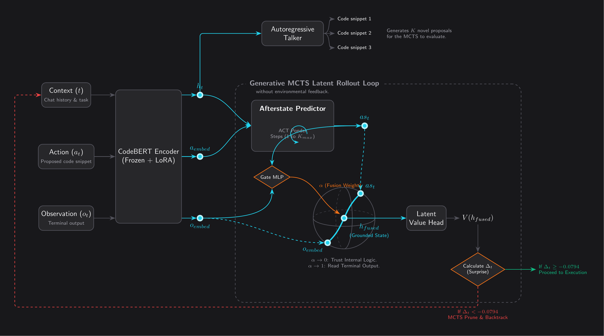
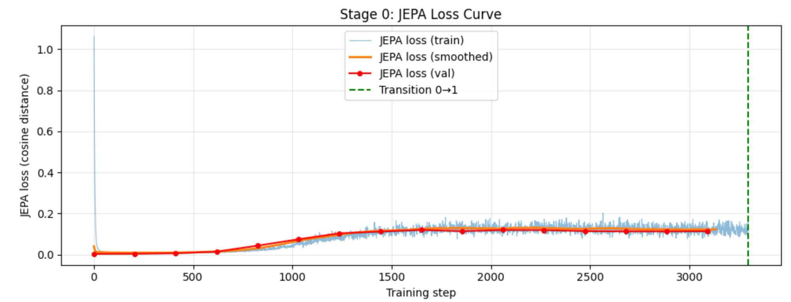
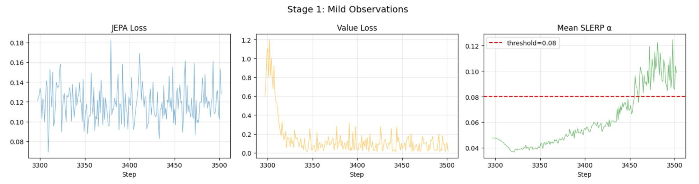
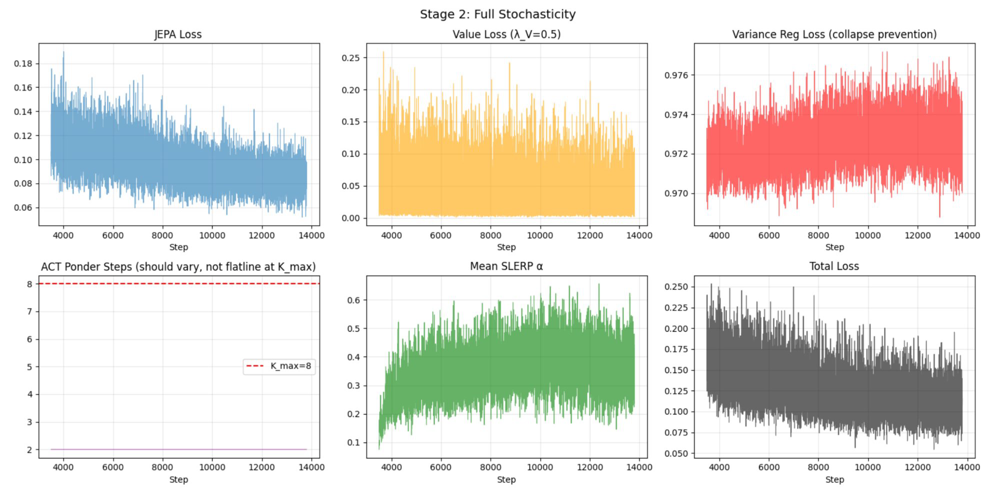
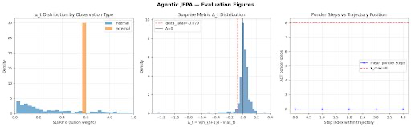
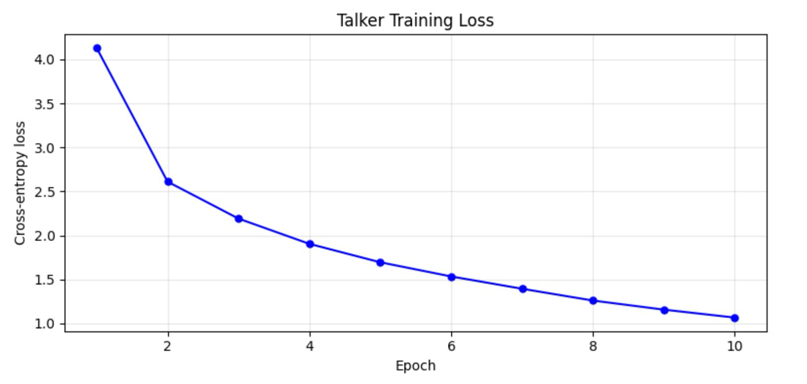

# Agentic-JEPA

**A continuous latent-space reasoning agent that uses Joint-Embedding Predictive Architectures and Adaptive Computation Time to plan before it acts.**

> Research prototype — trained and evaluated on [CodeActInstruct](https://huggingface.co/datasets/xingyaoww/code-act) trajectories using a single Colab T4 GPU.

<p align="center">
  
</p>

> **Diagram note:** The Autoregressive Talker and Generative MCTS loop (top of diagram) represent the Phase 2 design target. In the current prototype, actions are selected from a static vocabulary and the Talker is bypassed during inference. All other components — the CodeBERT encoder, Afterstate Predictor with ACT, Gated SLERP fusion, Latent Value Head, and Surprise-triggered backtracking — are fully implemented and trained.

---

## Motivation

Standard autoregressive ReAct agents generate tokens, act, fail, then waste tokens reading error messages to recover. Three structural problems make this unsustainable:

**Context Bloat.** ReAct agents lack persistent procedural memory. Tool definitions alone consume 40–50% of the context window, and raw environment feedback accounts for over 80% of total token usage. As interaction history grows, attention degrades and the agent begins misordering sub-tasks or hallucinating tool calls.

**The Benchmark Illusion.** SOTA models report high scores on SWE-bench, but audits reveal severe data contamination — models achieve up to 76% accuracy on context-free bug localization for SWE-bench tasks, dropping below 53% on uncontaminated external repositories. Performance is driven by memorization, not generalized reasoning.

**Computational Cost of Token-Based Search.** Bolting MCTS onto LLMs requires a full autoregressive text rollout for every node expansion. Self-attention scales as O(L²R + R²) per trajectory, forcing massive KV-cache recomputation across branches and rendering real-time token-based search intractable.

**Agentic-JEPA's approach:** shift reasoning, tool-use evaluation, and planning entirely into a continuous latent space (S^(d−1)). The agent simulates and scores outcomes before touching the real environment — acting more like a chess engine and less like a predictive text generator.

---

## Architecture

All computation occurs on an L2-normalized hypersphere. No tokens are generated during the planning phase.

### CodeBERT Encoder (LoRA-Adapted)

A frozen `microsoft/codebert-base` backbone with Low-Rank Adaptation (LoRA, rank=8, α=16) injected into query/value projections. The base model provides code-aware representations; LoRA adapters give the JEPA loss a gradient path into the encoder without the instability of full fine-tuning. Total trainable encoder parameters: **294,912** (0.24% of backbone).

### Afterstate Predictor with Adaptive Computation Time (ACT)

A 4-layer Transformer module that predicts the latent state of the world after an action is taken, entirely bypassing text generation. It incorporates an ACT halting loop (Graves, 2016) with differentiable per-step halting probabilities, dynamically choosing how many reasoning passes (1 to K_max=8) each input requires. The ponder cost formulation penalizes continuation probability for active steps: `Σ (1−p_k) · s_k`, where `s_k` is the still-running mask — an earlier `Σ p_k` formulation had inverted gradients and caused ponder saturation at K_max.

### Gated SLERP Fusion

A dynamic fusion layer that blends the agent's internal prediction (afterstate) with actual terminal output (observation) using Spherical Linear Interpolation (Shoemake, 1985). Standard LERP cuts through the hypersphere interior, producing vectors with contracted norms that fall off the manifold. SLERP traces the geodesic, preserving the unit-norm constraint.

A learned gate MLP produces α ∈ [0, 1]:

```
V_fused = SLERP(V_afterstate, V_obs; α)
        = [sin((1−α)θ)/sin(θ)] · V_afterstate + [sin(αθ)/sin(θ)] · V_obs
```

The gate bias is initialized to −3.0 (σ(−3.0) ≈ 0.047), ensuring near-zero fusion at training start to protect the manifold during Stage 0.

### Latent Value Head

A 3-layer MLP critic that maps fused latent states to a scalar success probability. Trained with dual-evaluation MSE: primary loss on post-SLERP fused states (for backtracking calibration), auxiliary loss on afterstates (for MCTS planning). In Stage 2, the auxiliary term is dropped to force all reward-prediction gradients through the SLERP gate.

### MCTS Planner & Surprise Metric

A Monte Carlo Tree Search operating over latent vectors. For each decision step, k candidate actions are embedded, scored by the Value Head, and the highest-value action is executed. After receiving the environment observation and running SLERP fusion, a surprise metric is computed:

```
Δ_t = V(h_fused) − V(as_t)
```

If Δ_t falls below a calibrated threshold, the agent backtracks instantly without parsing error text. The current prototype uses a discrete 5-branch search with ground-truth actions seeded as one branch (for evaluation) and random vocabulary samples for the rest, isolating the Value Head's ranking ability. Scaling to generative MCTS with learned action proposals is a Phase 2 goal.

---

## Training: 3-Stage Curriculum

Training a multi-objective latent agent requires carefully sequencing competing gradients. Naive joint training causes manifold collapse.

| Stage | Objective | Loss Weights (λ_JEPA, λ_V, λ_ponder) | Transition Criterion |
|-------|-----------|--------------------------------------|---------------------|
| **0 — Pure JEPA** | Stabilize the manifold. No observations, no value gradients. | 1.0, 0.0, 0.0 | JEPA val loss plateaus (< ε improvement for 3 consecutive evals) |
| **1 — Mild Observations** | Teach the SLERP gate to open. Introduce successful observations and clamped obs-utility loss. | 1.0, 0.1, 0.0 | Peak α exceeds threshold (0.08) AND JEPA loss within 5% of Stage 0 plateau |
| **2 — Full Stochasticity** | Introduce failure trajectories and ACT ponder penalty. Critical `as_t.detach()` before SLERP prevents JEPA gradient from crushing Value Head. | 1.0, 0.5, 0.05 | Train to convergence |

**Stage 0** stabilizes the latent manifold using only JEPA cosine distance loss. The LoRA adapters learn to separate context states on S^(d−1) while the EMA target encoder tracks slowly. The JEPA loss rises from near-zero (where the frozen CodeBERT backbone starts with nearly identical representations) to a stable plateau around 0.12 as the LoRA adapters learn to differentiate pre- and post-action contexts:

<p align="center">
  
</p>

**Stage 1** introduces observations and teaches the SLERP gate to open. The key challenge was **Observation Neglect** — at α ≈ 0.05, the sigmoid gradient is so small that the gate stays trapped shut. The fix: an asymmetric, clamped observation utility loss that only rewards the gate for reading useful observations (never penalizes). The rightmost panel shows α climbing past the 0.08 threshold, triggering the transition to Stage 2:

<p align="center">
  
</p>

**Stage 2** activates all losses including the ACT ponder penalty. The critical `as_t.detach()` barrier before SLERP fusion prevents the JEPA loss (λ=1.0) from dominating the Value Head loss (λ=0.5), giving the gate its own gradient channel. All six training signals converge:

<p align="center">
  
</p>

---

## Results & Evaluation

Trained on 1,000 CodeActInstruct trajectories (3,661 steps, 66.7% success rate), 13,802 total training steps on a single Colab T4 GPU. The prototype successfully proves the mechanical viability of continuous latent-space planning:

<p align="center">
  
</p>

**Stable Latent Manifold.** Final JEPA cosine distance reached **0.0842** (91.6% similarity between predicted and actual future states) with no representation collapse. A VICReg-style variance regularization term enforces isotropic spread across embedding dimensions.

**Economy of Computation.** The ACT loop successfully optimized down from K_max=8 to a stable **2.00 ponder steps**, proving the inverted-gradient fix successfully penalizes unnecessary computation. The rightmost panel shows the ponder count flatlined well below the K_max ceiling.

**Context-Aware Gating.** The SLERP gate learned to differentiate between internal and external observation types (left panel histogram). Mean α climbed from the 0.047 initialization to **0.35** over the course of training, with the gate opening wider when external terminal feedback carries useful information.

**Calibrated Backtracking.** The Surprise Metric (Δ_t) produced a clean, well-concentrated distribution (center panel), establishing a gradient-free backtracking threshold at **−0.0794** (5th percentile). The full inference loop — encode → predict → fuse → evaluate → backtrack — runs without tensor shape mismatches or memory leaks.

> **Current limitations:** Open-ended action generation is not yet functional. The Talker module is trained (final CE loss: 1.07, curve below) but produces incoherent code and is bypassed during inference in favor of a static action vocabulary. The K-way accuracy evaluation (selecting ground-truth from distractors) is designed but not yet run at scale. The inference demo uses a mock environment replaying ground-truth observations.

<p align="center">
  
</p>

---

## Future Roadmap

1. **Autoregressive Talker integration** — train a stronger decoder to generate open-ended actions from latent states, replacing the fixed vocabulary.
2. **Generative MCTS** — replace static action proposals with real-time latent-conditioned generation, enabling the planner to explore novel action sequences.
3. **Secure execution sandbox** — build a containerized Python execution environment for real (not mock) environment interaction.
4. **K-Way evaluation at scale** — run the generative ranking evaluation across the full validation set to quantify the Value Head's discriminative ability.

---

## Setup & Installation

```bash
git clone https://github.com/pu-suo/Agentic-JEPA.git
cd Agentic-JEPA
pip install torch transformers peft datasets
```

### Run Training (Colab T4, ~3–6 hours)

Open `notebook.ipynb` in Google Colab with a T4 GPU runtime. The notebook runs all three curriculum stages, talker training, calibration, and inference demo end-to-end.

For a quick smoke test (~20 min), override at the top of Cell 1:

```python
config.num_trajectories = 200
config.max_epochs_per_stage = 5
config.eval_every_n_steps = 20
```

### Project Structure

```
Agentic-JEPA/
├── config.py                    # All hyperparameters
├── notebook.ipynb               # Full training + eval pipeline
├── data/
│   ├── loader.py                # CodeActInstruct parser + dataset
│   └── action_classifier.py     # φ(a_t) heuristic (internal vs external)
├── models/
│   ├── encoders.py              # CodeBERT + LoRA encoder, EMA target encoder
│   ├── afterstate_predictor.py  # Transformer predictor with ACT loop
│   ├── slerp_fusion.py          # Gated SLERP on S^(d-1)
│   ├── value_head.py            # Latent critic network
│   └── talker.py                # Autoregressive decoder (Phase 2)
├── training/
│   ├── trainer.py               # Main training loop
│   ├── curriculum.py            # 3-stage controller
│   └── losses.py                # JEPA, value, obs-utility, variance reg
├── inference/
│   ├── mcts.py                  # Discrete MCTS planner
│   └── backtracking.py          # Surprise-triggered state reversion
└── utils/
    ├── math_utils.py            # L2 norm, cosine distance, safe SLERP
    └── ema.py                   # LoRA-aware EMA updates
```

---

## References

- Feng et al. (2020). *CodeBERT: A Pre-Trained Model for Programming and Natural Languages.*
- Hu et al. (2021). *LoRA: Low-Rank Adaptation of Large Language Models.*
- Graves (2016). *Adaptive Computation Time for Recurrent Neural Networks.*
- Shoemake (1985). *Animating Rotation with Quaternion Curves* (SLERP).
- Schrittwieser et al. (2020). *Mastering Atari, Go, Chess and Shogi by Planning with a Learned Model* (MuZero).
- Bardes et al. (2022). *VICReg: Variance-Invariance-Covariance Regularization for Self-Supervised Learning.*
- LeCun & Balestriero (2025). *LeJEPA: Provable and Scalable Self-Supervised Learning Without the Heuristics.*
- Assran et al. (2025). *V-JEPA 2: Self-Supervised Video Models Enable Understanding, Prediction and Planning.*

---

*This is a research prototype. The architecture demonstrates stable latent-space reasoning mechanics; open-ended autonomous capability requires the generative components described in the roadmap.*
